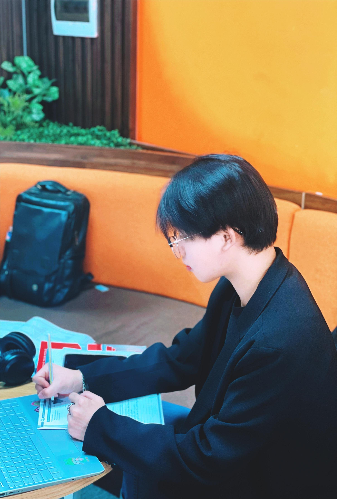
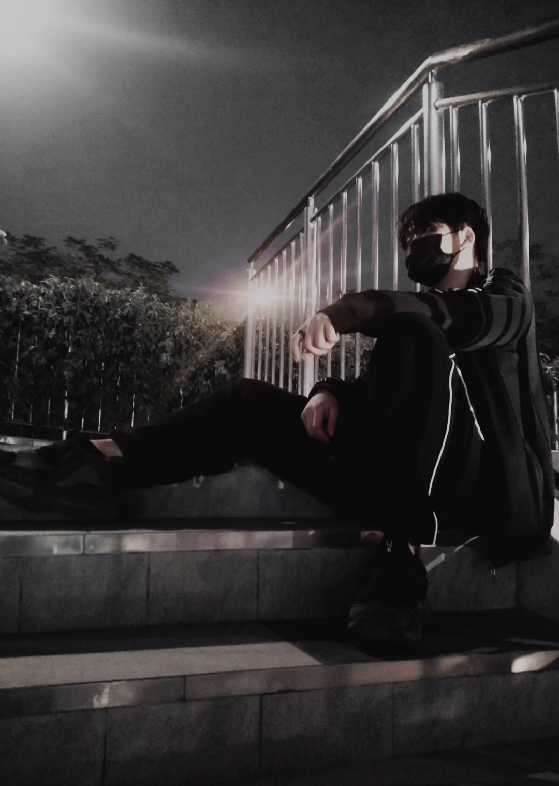

# Team Member
|          |          |             |           |
| :---------------------------: | :-------------------------: | :--------------------------: | :--------------------------: |
|      Nguyễn Thái Việt Huy     |        Nguyễn Như Bắc       |         Nguyễn Hoàng         |         Lê Xuân Quang        |

## Team Info
- **Team Name**: Group 5
- **Members**: Alice, Bob, Charlie
- **Project**: Focus Island

## Problem and Design Overview
We are solving the problem of maintaining focus in the digital age. Our design uses a metaphor of an island to represent the user's focus, integrating planning, break reminders, and reports.

## Design Research Process and Key Insights
We conducted research with three participants to understand their focus habits. Key insights include the importance of personalized feedback and minimizing digital distractions.
