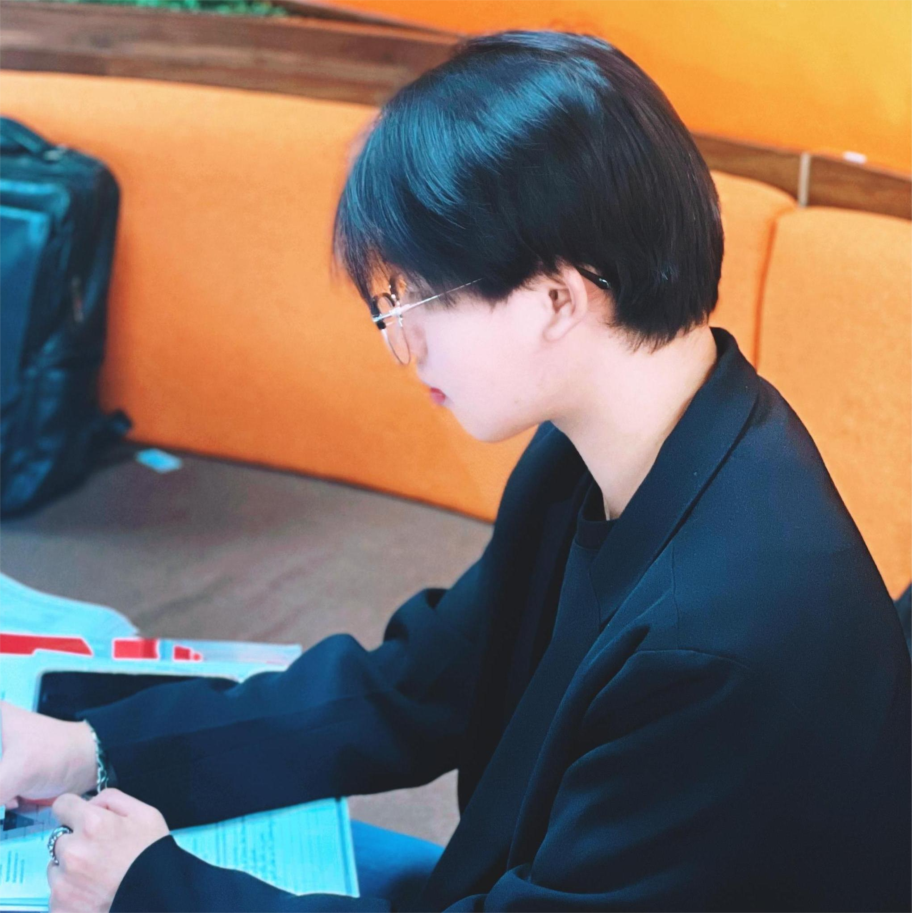
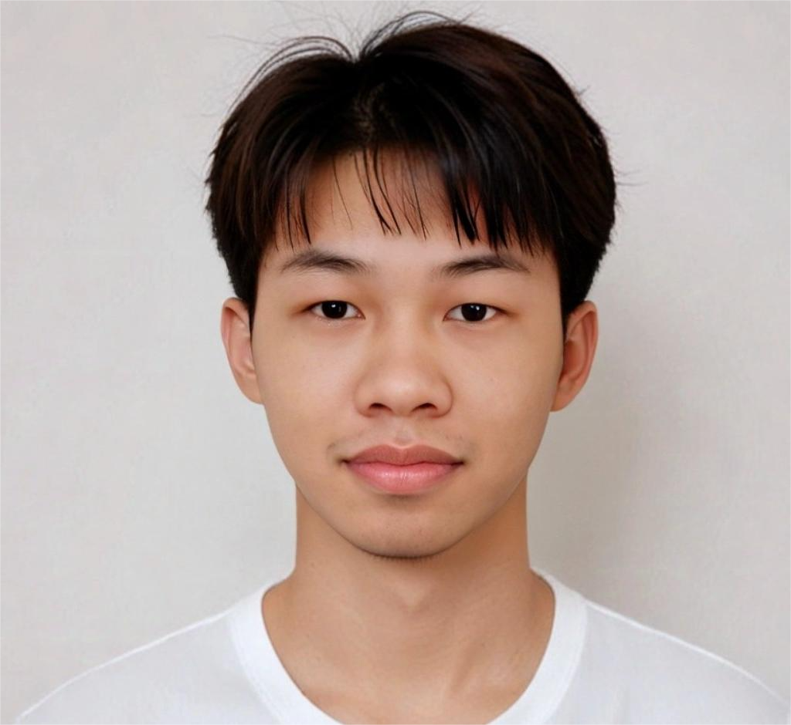
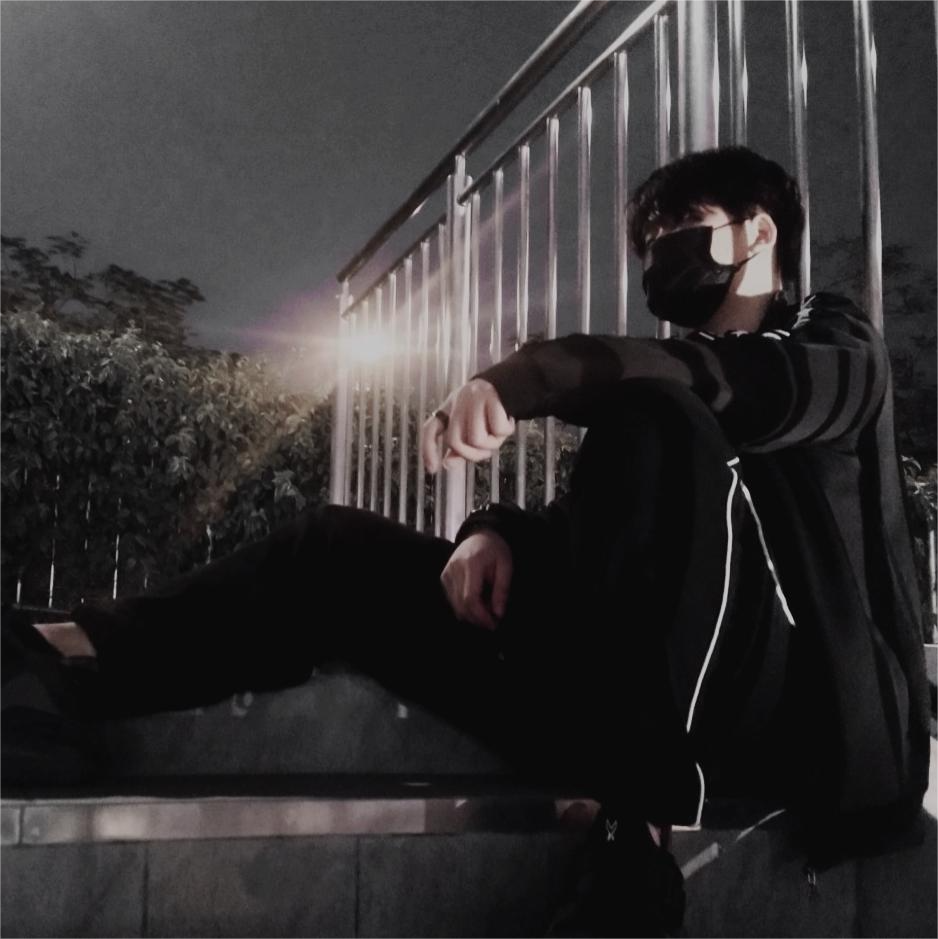
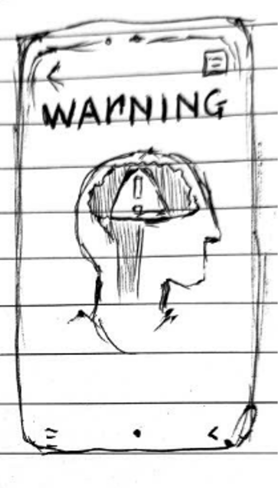
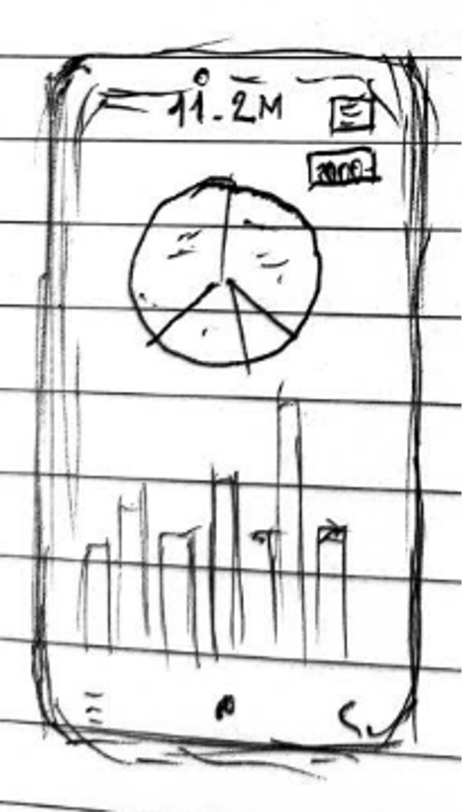

# Team Member

<table>
  <tr>
    <td></td>
    <td></td>
    <td></td>
    <td></td>
  </tr>
  <tr>
    <td>Nguyễn Thái Việt Huy</td>
    <td>Nguyễn Như Bắc</td>
    <td>Nguyễn Hoàng</td>
    <td>Lê Xuân Quang</td>
  </tr>
</table>

## Team Info
- **Team Name**: Group 6
- **Members**: Nguyễn Thái Việt Huy (Leader), Nguyễn Như Bắc, Nguyễn Hoàng, Lê Xuân Quang
- **Project**: Focus - Phát triển khả năng tập trung

## Problem and Design Overview
- **Vấn đề**: Trong xã hội hiện đại, sự tập trung đang bị thách thức bởi vô số yếu tố gây xao nhãng từ môi trường xung quanh, thông báo trên thiết bị kỹ thuật số, và cả những suy nghĩ lan man trong tâm trí. Việc mất tập trung gây ảnh hưởng tiêu cực đến năng suất làm việc, kết quả học tập, và thậm chí là sức khỏe tinh thần của mỗi người. Đặc biệt, những người trẻ tuổi, sinh viên, nhân viên văn phòng, hay những người làm việc trong môi trường đòi hỏi sự tập trung cao độ thường xuyên phải đối mặt với tình trạng này.
- **Giải pháp**: Ứng dụng di động "FocUs" được thiết kế để cải thiện mức độ tập trung của người dùng bằng cách phân tích sóng não. Ứng dụng sẽ thu thập dữ liệu sóng não thông qua thiết bị đeo hoặc cảm biến kết nối với điện thoại. Sau đó, ứng dụng sẽ phân tích dữ liệu này để hiểu rõ hơn về đặc điểm tập trung của từng cá nhân, xác định thời điểm tập trung tối ưu, khoảng thời gian cần nghỉ ngơi, và các yếu tố ảnh hưởng đến sự tập trung. Dựa trên những phân tích này, ứng dụng sẽ cung cấp các hỗ trợ cá nhân hóa như:
  - **Lập kế hoạch**: Ứng dụng sẽ đề xuất lịch trình làm việc/học tập phù hợp với khả năng tập trung của người dùng, đảm bảo họ có thể tập trung tối đa vào những công việc quan trọng nhất.
  - **Nhắc nhở nghỉ ngơi**: Ứng dụng sẽ gửi thông báo nhắc nhở người dùng nghỉ ngơi vào những thời điểm thích hợp để tránh kiệt sức và duy trì năng suất làm việc.
  - **Cung cấp báo cáo chi tiết**: Ứng dụng sẽ tạo ra các báo cáo về hiệu suất tập trung, bao gồm các thông tin như thời gian tập trung trung bình, số lần mất tập trung, và các yếu tố ảnh hưởng đến sự tập trung. Các báo cáo này sẽ giúp người dùng hiểu rõ hơn về thói quen làm việc của mình và tìm cách cải thiện.
  - **Điều chỉnh kế hoạch**: Ứng dụng có thể tự động điều chỉnh kế hoạch làm việc/học tập dựa trên dữ liệu sóng não thu thập được trong thời gian thực, đảm bảo kế hoạch luôn phù hợp với khả năng tập trung của người dùng.
  
<small>Trong quá trình phát triển FocUs, nhóm chọn thiết kế "Focus Island" vì nó sử dụng một cách tiếp cận trực quan và sinh động với hình ảnh của một hòn đảo để thể hiện trạng thái tập trung của người dùng. Sự thay đổi môi trường trên đảo tương ứng với mức độ tập trung và sự phân tâm của người dùng, giúp họ dễ dàng hiểu và điều chỉnh hành vi. Việc xây dựng công trình trên đảo đại diện cho quá trình hoàn thành công việc, kết hợp với các thông báo nghỉ ngơi và thời điểm tối ưu, tạo nên một giao diện thân thiện và hiệu quả cho đối tượng người dùng là sinh viên và nhân viên văn phòng. Những nhiệm vụ này hấp dẫn vì chúng cung cấp phản hồi liên tục và mang tính cá nhân, giúp người dùng cải thiện tập trung theo cách thú vị và có thể duy trì trong thời gian dài.</small>
<table>
  <tr>
    <td></td>
    <td></td>
    <td></td>
  </tr>
  <tr><small><i>
    <td>FocUs Island</td>
    <td>Warning</td>
    <td>Report</td>
  </i></small></tr>
</table>
## Design Research Process
- **Xác định người dùng mục tiêu:**
  - Nghiên cứu này tập trung vào những người thường xuyên gặp khó khăn trong việc duy trì sự tập trung và mong muốn cải thiện hiệu suất làm việc/học tập.
  - Nhóm đối tượng mục tiêu bao gồm:
    - Sinh viên: Thường gặp áp lực trong học tập, thi cử và dễ bị phân tâm bởi các yếu tố xung quanh.
    - Nhân viên văn phòng: Phải xử lý nhiều công việc cùng lúc, dễ bị phân tâm bởi email, thông báo và môi trường làm việc ồn ào.
    - Freelancer: Cần quản lý thời gian hiệu quả và duy trì sự tập trung khi làm việc tại nhà hoặc các không gian làm việc chung.
- **Thu thập dữ liệu:**
  - **Phỏng vấn:** Tiến hành phỏng vấn sâu với từng cá nhân thuộc nhóm đối tượng mục tiêu để hiểu rõ hơn về những khó khăn họ gặp phải trong việc duy trì sự tập trung, nhu cầu và mong muốn của họ đối với một ứng dụng hỗ trợ tập trung.
  - **Khảo sát:** Thực hiện khảo sát với quy mô lớn hơn để thu thập thông tin định lượng về thói quen làm việc, mức độ tập trung, và các yếu tố ảnh hưởng đến sự tập trung của nhóm đối tượng mục tiêu.
  - **Quan sát:** Quan sát trực tiếp cách người dùng làm việc và học tập trong môi trường thực tế để nhận biết các yếu tố gây phân tâm và những thói quen ảnh hưởng đến sự tập trung.
- **Phân tích dữ liệu:**
  - Tổng hợp và phân tích dữ liệu thu thập được từ các phương pháp trên để xác định các nhiệm vụ quan trọng mà ứng dụng cần hỗ trợ. Ví dụ: lập kế hoạch, theo dõi thời gian, nhắc nhở nghỉ ngơi, cung cấp báo cáo, và điều chỉnh kế hoạch dựa trên dữ liệu sóng não.
  - Xác định các yếu tố chính ảnh hưởng đến sự tập trung của người dùng, như môi trường làm việc, thời gian trong ngày, loại công việc, và trạng thái tinh thần.
- **Phác thảo ý tưởng:**
  - Dựa trên kết quả phân tích dữ liệu, nhóm đã phác thảo nhiều ý tưởng thiết kế giao diện khác nhau, mỗi ý tưởng tập trung vào một phong cách và cách tiếp cận khác nhau. Ví dụ: giao diện dòng thời gian, bản đồ não, trò chơi hóa, hòn đảo tập trung...
  - Mỗi bản phác thảo bao gồm mô tả chi tiết về giao diện, cách thức hoạt động, và các nhiệm vụ được hỗ trợ.
- **Đánh giá và lựa chọn:**
  - Thực hiện các buổi đánh giá thiết kế với người dùng tiềm năng để thu thập phản hồi về các ý tưởng phác thảo.
  - Đánh giá các ý tưởng dựa trên các tiêu chí như:
    - Tính hiệu quả: Thiết kế có hỗ trợ người dùng cải thiện mức độ tập trung và hiệu suất làm việc không?
    - Tính thân thiện: Giao diện có dễ sử dụng và trực quan không?
    - Tính thẩm mỹ: Thiết kế có hấp dẫn và thu hút người dùng không?
  - Lựa chọn một thiết kế tối ưu để phát triển dựa trên kết quả đánh giá và phân tích.
## Key Insights
- **Mất tập trung là một thách thức phổ biến:** Phần lớn người dùng, bất kể ngành nghề hay độ tuổi, đều gặp khó khăn trong việc duy trì sự tập trung, đặc biệt là trong môi trường làm việc và học tập hiện đại với nhiều yếu tố gây xao nhãng.
- **Nhu cầu cá nhân hóa cao:** Mỗi người có những đặc điểm tập trung khác nhau, chịu ảnh hưởng bởi các yếu tố khác nhau. Do đó, người dùng mong muốn một giải pháp được cá nhân hóa, có thể thích ứng với nhu cầu và thói quen riêng của họ.
- **Dữ liệu sóng não là chìa khóa:** Việc phân tích dữ liệu sóng não cung cấp cái nhìn sâu sắc về hoạt động não bộ và khả năng tập trung của người dùng, từ đó giúp ứng dụng đưa ra các hỗ trợ chính xác và hiệu quả hơn.
- **Giao diện đóng vai trò quan trọng:** Giao diện trực quan, thân thiện và dễ sử dụng là yếu tố quan trọng để thu hút và giữ chân người dùng. Thiết kế cần tối giản, tránh gây rối mắt, và tập trung vào việc hiển thị thông tin một cách rõ ràng, dễ hiểu.
- **Kết hợp nhiều phương pháp hỗ trợ:** Ứng dụng không chỉ đơn thuần là công cụ theo dõi và phân tích, mà còn cần tích hợp nhiều phương pháp hỗ trợ khác nhau, như lập kế hoạch, nhắc nhở nghỉ ngơi, cung cấp bài tập luyện tập trung, kỹ thuật thư giãn... để mang lại hiệu quả toàn diện.
- **Tạo động lực và duy trì sự hứng thú:** Ứng dụng cần có yếu tố tạo động lực để khuyến khích người dùng duy trì việc sử dụng và theo đuổi mục tiêu cải thiện tập trung. Các yếu tố như game hóa, thành tích, phần thưởng... có thể được áp dụng.
